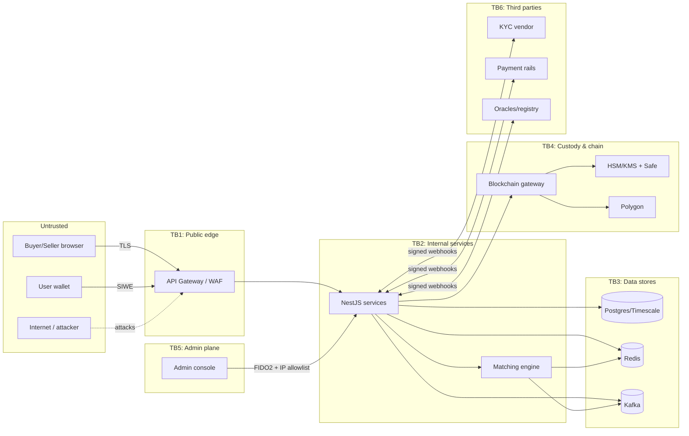

# 07 — Threat Model (STRIDE per Trust Boundary)

Makes [05-security-compliance.md](./05-security-compliance.md) actionable. For each trust
boundary we enumerate STRIDE threats (**S**poofing, **T**ampering, **R**epudiation,
**I**nformation disclosure, **D**enial of service, **E**levation of privilege), the concrete
attack, the mitigation, and where it's owned. Ratings use a simple **Likelihood × Impact →
Risk** (L/M/H). This is a living document — revisit before each release gate and after any
architecture change.

## Trust boundaries (data-flow diagram)

Boundaries: **TB1** browser↔edge, **TB2** edge↔services, **TB3** services↔data, **TB4**
services↔custody/chain, **TB5** admin↔platform, **TB6** platform↔third parties.

---

## TB1 — Public edge (browser/wallet ↔ API Gateway)

| # | STRIDE | Attack | Mitigation | Owner | Risk |
|---|--------|--------|-----------|-------|------|
| 1.1 | S | Credential stuffing / account takeover | Argon2id, MFA (TOTP/WebAuthn), breached-password check, device-fingerprint step-up, login rate limit + lockout | Identity | H→**M** |
| 1.2 | S | SIWE replay / wrong-domain signature | Domain-bound SIWE message, single-use nonce, short replay window, chain-id binding | Identity | M→**L** |
| 1.3 | S | Stolen/forged JWT | Short-lived access (15m), rotating refresh stored hashed, asymmetric signing, `act`/`roles` claims verified per request | Gateway | M→**L** |
| 1.4 | T | Request tampering / param injection | TLS 1.3, schema validation, reject-unknown-fields on money endpoints, parameterized queries | Gateway/Svc | M→**L** |
| 1.5 | R | User denies placing an order/withdrawal | Idempotency-Key + immutable order/ledger records + signed session context; audit trail | Trading/Ledger | M→**L** |
| 1.6 | I | PII/token leakage in responses/logs | Field-level PII encryption, response DTO allowlists, PII redaction in logs, no secrets in errors | All svc | H→**M** |
| 1.7 | D | Credential-free API flooding / L7 DDoS | CDN DDoS protection, WAF, per-IP + per-account token buckets, anonymous market-data tier caps | Gateway | H→**M** |
| 1.8 | E | Horizontal priv-esc (act on another account) | `act` claim checked against `org_members`; object-level authZ on every resource; deny by default | Svc | H→**M** |

## TB2 — Edge ↔ internal services (incl. the matching engine)

| # | STRIDE | Attack | Mitigation | Owner | Risk |
|---|--------|--------|-----------|-------|------|
| 2.1 | S | Service impersonation on the internal network | mTLS between services / mesh identity, network policies, no service reachable from public subnet | DevOps | M→**L** |
| 2.2 | T | Forged order events into Kafka | Signed/authenticated producers, ACLs per topic, schema-registry enforcement, consumer idempotency (event-id dedupe) | Systems | H→**M** |
| 2.3 | T | Order-book manipulation via malformed orders | Tick/lot/min-notional + price-band validation before the book; self-trade prevention | Trading/Engine | H→**M** |
| 2.4 | R | A trade can't be traced to an actor | Event-sourced log (Kafka) with actor + order id; deterministic replay; `AuditAnchor` roots on-chain | Systems | M→**L** |
| 2.5 | I | Cross-service data over-reach (reading another schema) | Single-writer rule + per-service DB roles (write own schema only); reads via API/events | DevOps/Svc | M→**L** |
| 2.6 | D | Engine overload / hot-partition starvation | Per-market sharding, backpressure, order-rate caps per account/tier, circuit breakers | Systems | M→**M** |
| 2.7 | E | A compromised low-priv service mints/settles | Only the blockchain gateway holds `SETTLER`; mint needs multi-sig; least-privilege service roles | DevOps | H→**M** |

## TB3 — Services ↔ data stores

| # | STRIDE | Attack | Mitigation | Owner | Risk |
|---|--------|--------|-----------|-------|------|
| 3.1 | T | Direct DB write bypassing the ledger invariants | No shared write creds; ledger is append-only (no UPDATE/DELETE grant on `entries`); balanced-legs constraint | Ledger | H→**M** |
| 3.2 | T | Double-spend via race on holds | Row locks / `SELECT … FOR UPDATE` on the ledger account, hold-before-match, serializable-enough isolation | Ledger | H→**M** |
| 3.3 | I | Dump of PII / KYC docs at rest | Field-level envelope encryption (KMS), encrypted volumes, IPFS stores only encrypted pointers, least-priv access | DevOps | H→**M** |
| 3.4 | R | Silent history rewrite in Postgres | Append-only journals, hash-chained `admin.audit_log`, periodic on-chain root anchoring | DevOps | M→**L** |
| 3.5 | D | Redis/Kafka outage stalls trading | Redis snapshot rebuildable from Kafka; engine replay on restart; managed HA clusters; graceful degrade | DevOps | M→**M** |
| 3.6 | I | Backup exfiltration | Encrypted backups, restricted restore access, PITR keys in KMS, backup-access auditing | DevOps | M→**L** |

## TB4 — Custody & blockchain (the crown jewels)

| # | STRIDE | Attack | Mitigation | Owner | Risk |
|---|--------|--------|-----------|-------|------|
| 4.1 | E | Attacker mints unbacked credits | Multi-sig on `mint`; `registryRetired==true` required; two contract audits; timelock on upgrades | Contracts | H→**M** |
| 4.2 | T | Drain hot wallet via stolen settler key | ≥95% cold, hot float capped, key in HSM, rotatable `SETTLER`, withdrawal allowlist + 24h delay, anomaly alerts | Custody | H→**M** |
| 4.3 | T | Malicious/negligent contract upgrade | UUPS behind multi-sig **and** `TimelockController` (public pending window); on-chain visibility | Contracts | H→**M** |
| 4.4 | T | Reentrancy / integer / logic bug in settle/retire | `nonReentrant`, checks-effects-interactions, OZ libs, Foundry invariant/fuzz tests, Slither/Mythril in CI | Contracts | H→**M** |
| 4.5 | R | Off-chain balances diverge from chain undetected | Continuous reconciliation job diffs ledger vs. chain; drift → asset freeze + finance alert | Chain/Finance | H→**M** |
| 4.6 | I | Deanonymization via on-chain PII | Never put PII on-chain; only hashes/pseudonymous addresses; certificate beneficiary name is opt-in/pseudonymizable | Contracts | M→**L** |
| 4.7 | D | Gas-tank exhaustion halts settlement | Gas-tank balance monitor + auto-topup + low-balance alert; batch sizing tuned; degrade to queue not to loss | Chain | M→**M** |
| 4.8 | D | Chain reorg reverts a "confirmed" settlement | Wait N confirmations before marking settled; reorg handler re-derives from `chain.events`; idempotent ingestion | Chain | M→**M** |

## TB5 — Admin plane (highest blast radius)

| # | STRIDE | Attack | Mitigation | Owner | Risk |
|---|--------|--------|-----------|-------|------|
| 5.1 | S | Admin account takeover | **Mandatory FIDO2/YubiKey**, IP allowlist, separate admin IdP, no password-only path | Security | H→**M** |
| 5.2 | E | Over-broad admin acts beyond role | Fine-grained admin roles (§05 hierarchy); mint/treasury need multi-sig even for super-admin | Security | H→**M** |
| 5.3 | R | Rogue admin edits data, denies it | Every admin mutation → hash-chained `admin.audit_log`, roots anchored on-chain; admins are surveilled | Security | H→**M** |
| 5.4 | T | Malicious market halt / trade rollback | Maker-checker on high-impact ops; rollbacks emit on-chain correction records; alerting on halts | Market-ops | M→**M** |
| 5.5 | I | Support agent views full PII | PII masked for support role; unmask is a logged, justified, time-boxed action | Compliance | M→**L** |

## TB6 — Third parties (KYC, payments, oracles/registry)

| # | STRIDE | Attack | Mitigation | Owner | Risk |
|---|--------|--------|-----------|-------|------|
| 6.1 | S | Forged KYC/payment webhook | Verify webhook signatures + source allowlist + replay nonce; never trust body alone | Integrations | H→**M** |
| 6.2 | T | Compromised oracle feeds bad MRV/price | Multiple oracle sources, sanity/deviation bounds, `ORACLE_ROLE` scoping, manual override + pause | Chain | M→**M** |
| 6.3 | D | Vendor outage blocks onboarding/settlement | Graceful degrade, ret/queue, secondary provider where feasible, status alerts | Integrations | M→**M** |
| 6.4 | I | Data over-shared with a vendor | Minimize payloads, DPA in place, encrypt in transit, scope API keys | Compliance | M→**L** |
| 6.5 | R | Registry double-issuance dispute | Store registry serials + retirement proofs; Transparency Explorer; Phase-2 automated cross-check | Carbon | H→**M** |

---

## Top risks to burn down first (pre-mainnet)

1. **Unbacked mint / custody drain** (4.1, 4.2) — multi-sig + `registryRetired` gate + audits.
   Non-negotiable; gates M5 in [06](./06-roadmap-sprints.md).
2. **Off-chain/on-chain divergence** (4.5) — the reconciliation job is the safety net for the
   entire hybrid model; prove it detects injected drift during Sprint 5 and the game day.
3. **Admin plane compromise** (5.1–5.3) — hardware keys + hash-chained audit + multi-sig on
   privileged on-chain ops.
4. **Double-spend race** (3.2) and **forged order events** (2.2) — the trading hot path's
   integrity.
5. **Double-counting / registry integrity** (6.5, 4.1) — the "can the planet trust the
   credit?" test; zero-incident is release-blocking.

## Assumptions & residual risk
- Assumes managed HA data stores and a reputable MPC custody provider; self-hosting shifts
  several TB3/TB4 mitigations to us (README open question #3).
- Residual trust in the off-chain matching operator during the match→settle window is
  **accepted and disclosed**, mitigated by event-sourcing, published Merkle roots, surveillance,
  and reconciliation (ADR-001). This is the core trade-off of a hybrid exchange.
- Third-party vendor compromise (TB6) is partially outside our control; contain via signature
  verification, least data, and DPAs.

## Method note
STRIDE-per-boundary, refreshed each release gate and on architecture change. Pair with the
§05 release-gate checklist (pen test + audits validate these mitigations empirically). New
features add rows to the boundary they touch before they ship.
