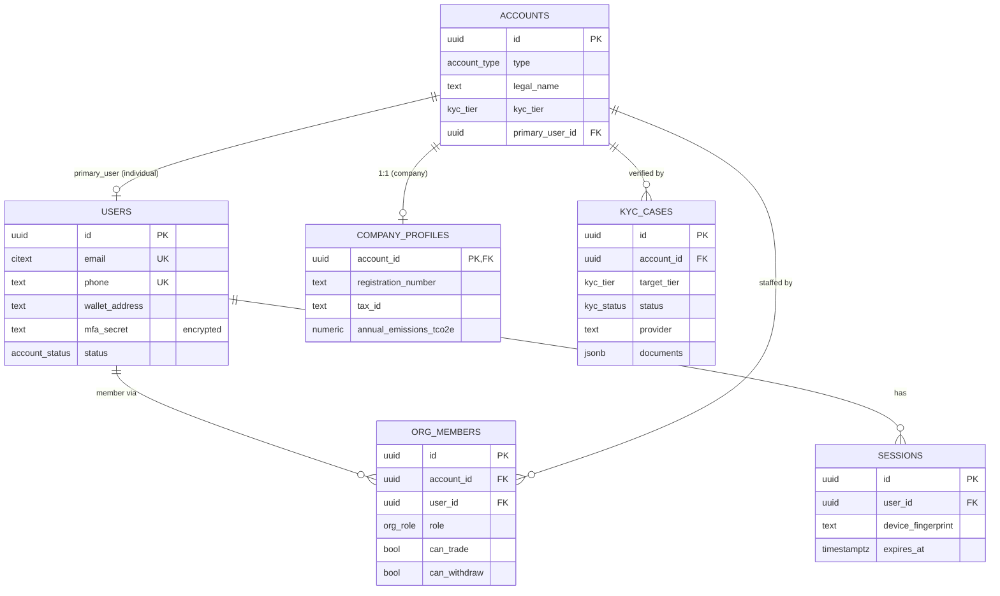
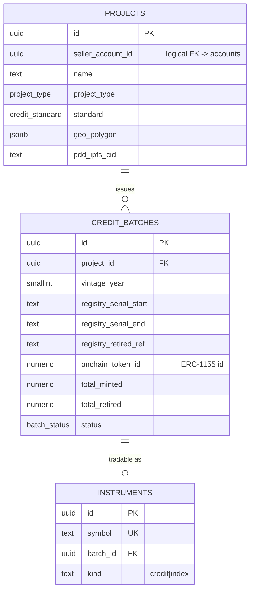
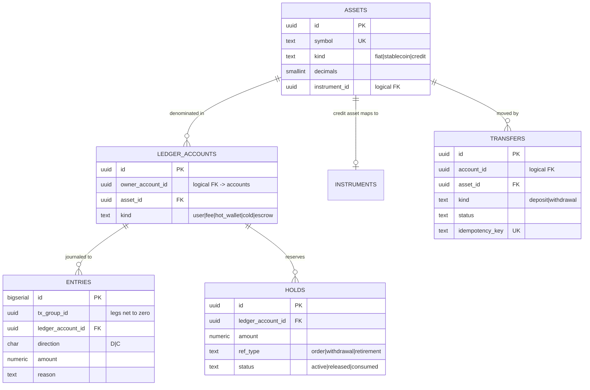
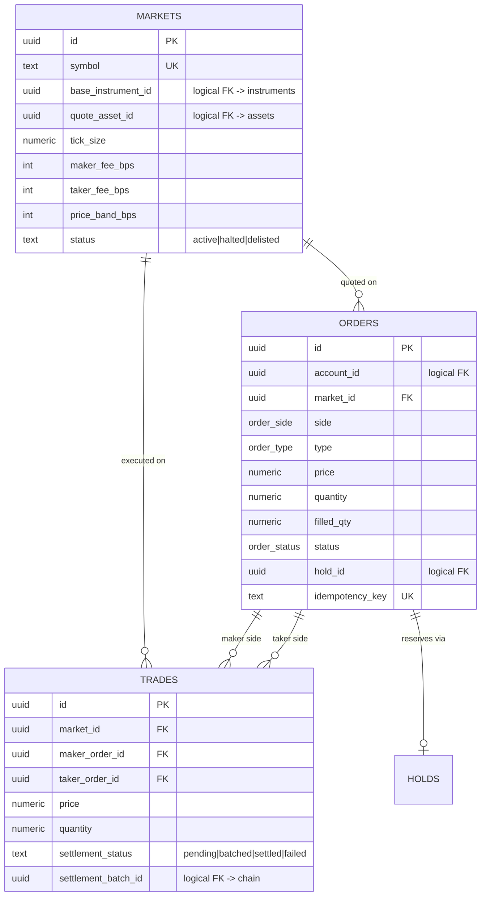
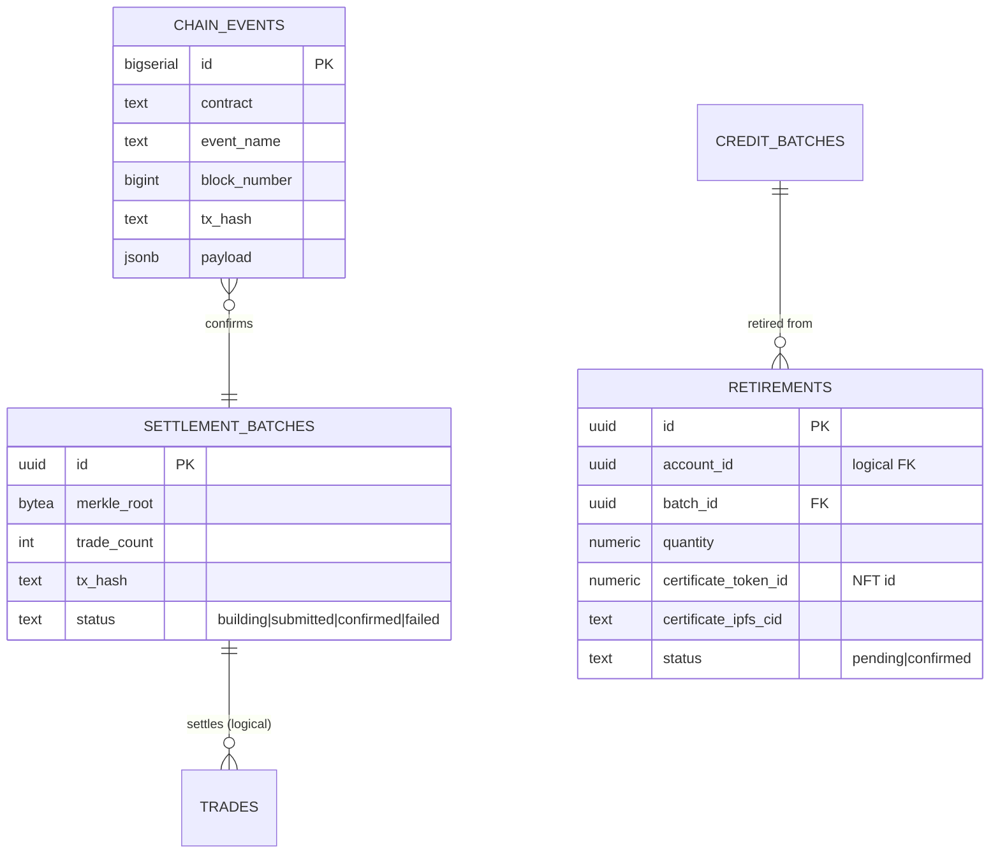
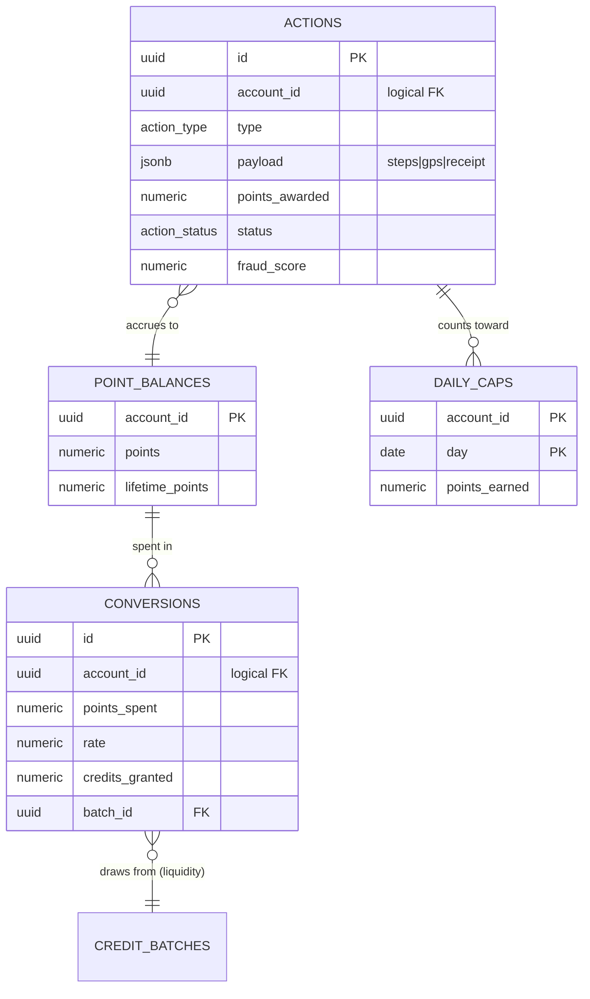
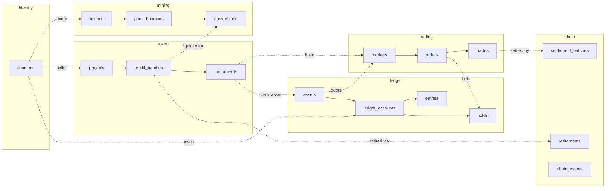

# Data Model — Entity Relationship Diagrams

Visual companion to [02-data-model.md](../02-data-model.md). Rendered with Mermaid (GitHub,
VS Code, and most doc tools render these natively). Cross-schema relationships are **logical /
application-enforced** (dashed intent), not DB foreign keys — per the single-writer rule
(ADR-005). Split by schema for readability, then a cross-schema overview.

## `identity` — accounts, users, KYC

## `token` — projects, batches, instruments

## `ledger` — double-entry money model

## `trading` — markets, orders, trades

## `chain` — settlement & on-chain events

## `mining`

## Cross-schema overview (logical links)

Dashed lines are application-enforced boundaries (single-writer per service, ADR-005).

> To render as images for a slide deck: paste any block into the
> [Mermaid Live Editor](https://mermaid.live) and export SVG/PNG. Keep the source here as the
> versioned truth; export copies as needed.
