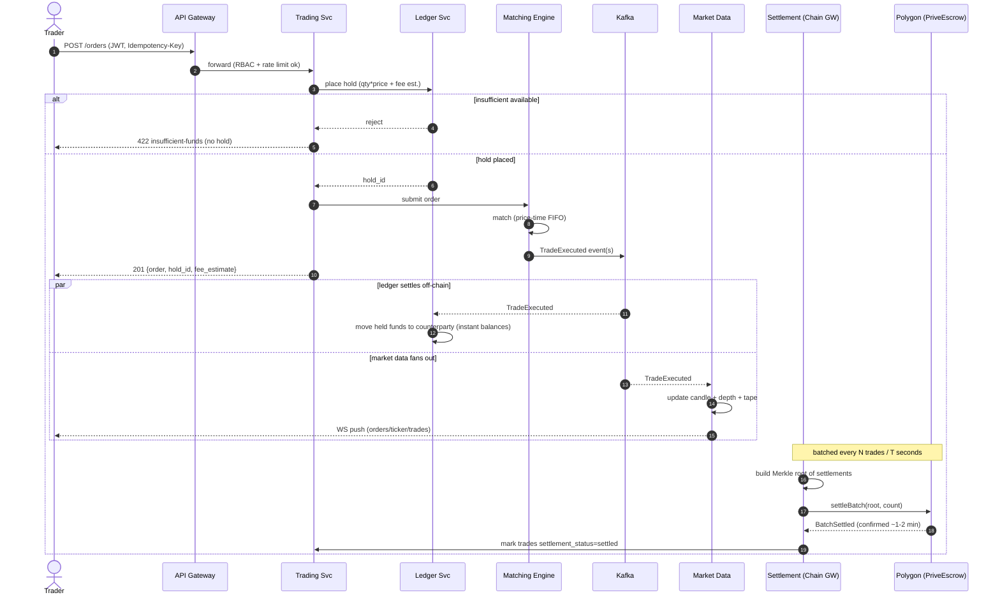
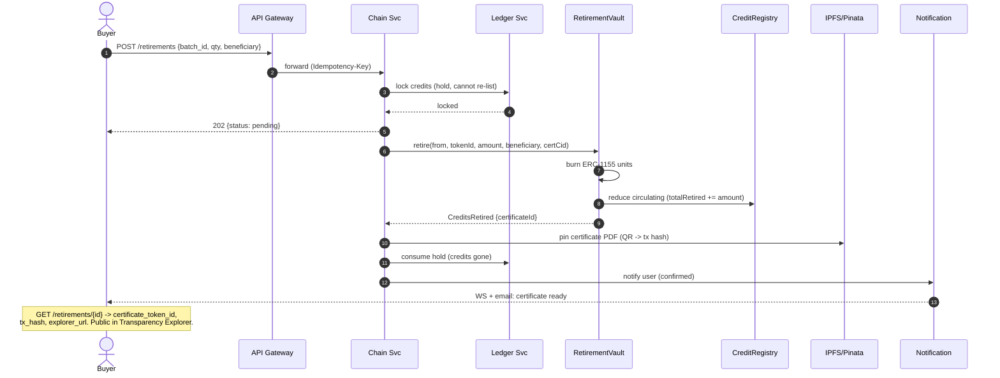
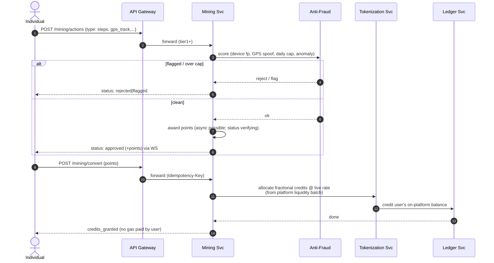

# Sequence Flows

Visual companion to the data-flow narratives in [01-architecture.md](../01-architecture.md) §2.
Mermaid sequence diagrams for the flows where ordering, holds, and on/off-chain boundaries
matter most. These are the flows to get right first — they carry money and carbon integrity.

## 1. Place & settle a trade (the hot path)



**Why holds first:** the ledger reserves funds *before* the order reaches the book, so a fill
can never overspend. Off-chain balances update the instant `TradeExecuted` is consumed
(optimistic UI); on-chain finality follows in the batched settlement. A reconciliation job
(§05) continuously proves the two agree.

## 2. Retire (offset) credits → certificate NFT



**Integrity:** retirement is a real burn; the certificate NFT is non-transferable; the credit
can never re-enter the market. This is the "can the planet trust the credit?" endpoint.

## 3. Mining action → points → credit conversion



**Gas abstraction:** no per-action chain tx. Grants net inside the platform and settle to real
ERC-1155 balances in batches (`MiningRewards.accrue`/`settle`, §04). Users never see gas.

## 4. Admin-minted tokenization (Phase 1, multi-sig gated)

```mermaid
sequenceDiagram
    autonumber
    actor V as Verification Mgr
    actor S as Safe Signers (multi-sig)
    participant AD as Admin BFF
    participant TK as Tokenization Svc
    participant IPFS as IPFS/Pinata
    participant CR as CreditRegistry
    participant AUD as admin.audit_log

    V->>AD: review batch (pre-verified, registry serials retired)
    AD->>AUD: log intent (hash-chained)
    AD->>IPFS: pin batch metadata (project, vintage, verifier, geo hash)
    IPFS-->>AD: cid + sha256
    AD->>CR: registerBatch(tokenId, info{registryRetired:true}, cid)
    Note over AD,S: mint requires multi-sig quorum
    AD->>S: propose mint(tokenId, sellerWallet, amount)
    S-->>CR: mint() (quorum signatures)
    CR-->>AD: CreditsMinted event
    AD->>TK: batch status -> minted; onchain_token_id set
    AD->>AUD: log executed mint (anchored on-chain via AuditAnchor)
```

**Guardrail:** `CreditRegistry.mint()` reverts unless `registryRetired == true` — no token
without a corresponding tonne retired at the legacy registry. At MVP that flag is
admin-attested (README open question #4); Phase 2 sets it via the registry-API oracle.

## 5. KYC onboarding (tiered)

```mermaid
sequenceDiagram
    autonumber
    actor U as User
    participant GW as API Gateway
    participant ID as Identity Svc
    participant KV as KYC Vendor (Sumsub)
    participant IPFS as IPFS/Pinata
    actor C as Compliance Officer

    U->>GW: POST /kyc/cases {target_tier}
    GW->>ID: create case (pending)
    ID->>KV: create applicant
    KV-->>ID: provider_ref
    U->>GW: POST /kyc/cases/{id}/documents (ID, selfie)
    GW->>ID: attach
    ID->>IPFS: pin (encrypted pointer); store sha256
    ID->>KV: submit for check
    KV-->>ID: webhook: result (clear|review|hit)
    alt clear
        ID->>ID: advance tier limits
        ID-->>U: approved (tier upgraded)
    else review
        ID->>C: queue for manual decision (admin console)
        C-->>ID: approve / reject (+reason, audit-logged)
        ID-->>U: decision
    end
```

> Render/export: paste any block into [mermaid.live](https://mermaid.live). Source stays here
> as the versioned truth.
